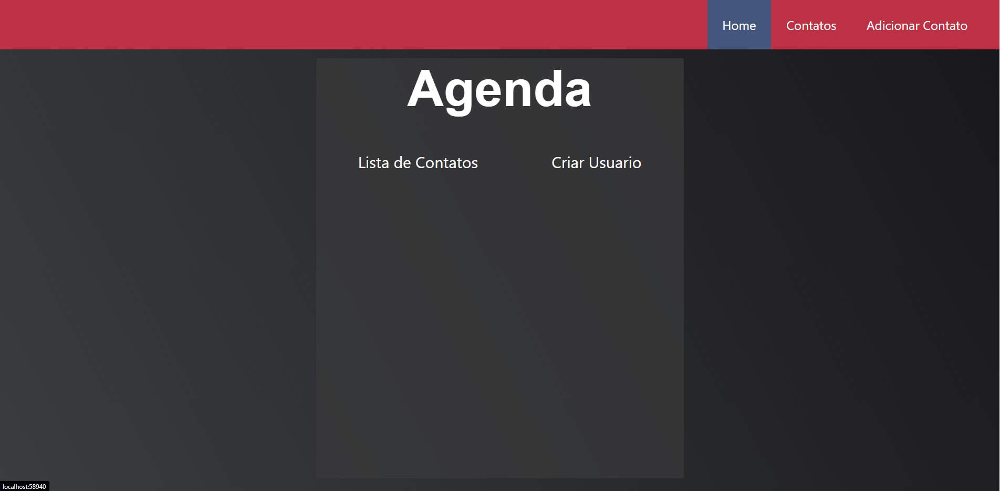
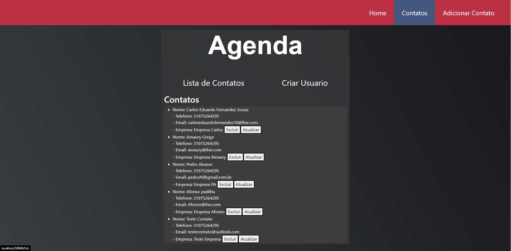
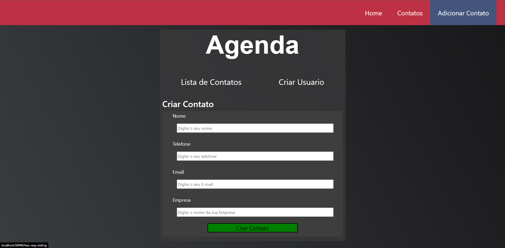
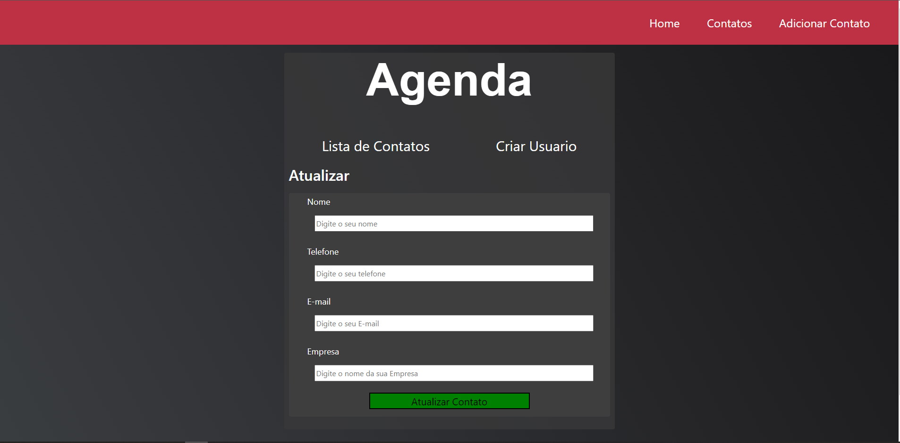

# Trabalho Angular

Projeto desenvolvido em angular. A aplicação tem como objetivo seguir o fluxo de um CRUD, create, update,delete e read. Tem toda a rotina de cadastro de uma agenda de contatos.
Usando Json Serve

HOME

Listagem de Contatos

Criar/Adicionar Contato

Atualizar Contato
